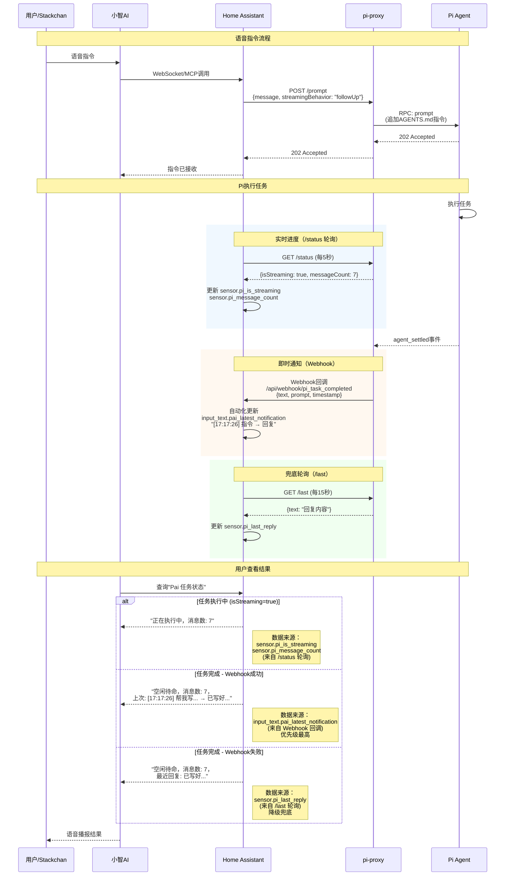

# Home Assistant 集成架构

本文档说明 pi-proxy 与 Home Assistant 的集成架构和数据流。

## 系统架构图



## 数据流说明

### 1. 指令发送流程

```
用户语音 → 小智AI → Home Assistant → pi-proxy → Pi Agent
```

- **小智AI → HA**：通过 `ws_mcp_server` 插件（WebSocket MCP 协议）
- **HA → pi-proxy**：通过 `rest_command.pi_prompt`
  - 参数：`streamingBehavior: "followUp"` 支持任务排队
- **pi-proxy → Pi**：通过 JSONL RPC（stdin/stdout）
  - Pi 自动读取 workspace 的 `AGENTS.md` 作为系统指令

### 2. 结果获取机制（双通道）

系统使用**双通道**获取 Pi 的回复结果：

| 通道 | 更新方式 | 延迟 | 数据内容 | 存储位置 |
|------|---------|------|---------|---------|
| **Webhook 回调** | 推送（Push） | 即时 | 时间戳 + 原始指令 + 回复 | `input_text.pai_latest_notification` |
| **REST 轮询 /last** | 拉取（Pull） | 最多 15 秒 | 仅回复文本 | `sensor.pi_last_reply` |

**Webhook 回调（主通道）：**
- Pi 完成任务后，pi-proxy 立即发送 webhook 到 HA
- HA 自动化格式化为：`[HH:MM:SS] 原始指令 → 回复内容`
- 优点：即时、包含完整上下文

**REST 轮询（兜底通道）：**
- HA 每 15 秒轮询 `/last` 接口获取最新回复
- 用途：webhook 失败时的降级方案、HA 重启后的初始状态

### 3. 状态监控

通过 `/status` 接口轮询（每 5 秒）获取实时状态：

- `sensor.pi_running`：pi-proxy 服务是否运行
- `sensor.pi_is_streaming`：Pi 是否正在执行任务
- `sensor.pi_message_count`：当前会话消息数

### 4. 用户看到的结果展示

模板传感器 **"Pai 任务状态"** 根据优先级展示信息：

| 状态 | 显示内容 | 数据来源 | 更新频率 |
|------|---------|---------|---------|
| 执行中 | "正在执行中，消息数: X" | `/status` 轮询 | 每 5 秒 |
| 完成（正常） | "[时间] 指令 → 回复" | Webhook → `input_text.pai_latest_notification` | 即时 |
| 完成（webhook失败） | "最近回复: 内容" | `/last` 轮询 → `sensor.pi_last_reply` | 每 15 秒 |

**优先级逻辑：**
```
if isStreaming == true:
    显示 "正在执行中" (来自 /status)
elif input_text.pai_latest_notification 有效:
    显示 webhook 通知 (优先级最高)
elif sensor.pi_last_reply 有效:
    显示 /last 轮询结果 (降级兜底)
else:
    显示 "空闲待命"
```

## Home Assistant 配置示例

### REST 命令（发送指令）

```yaml
rest_command:
  pi_prompt:
    url: "http://<PI_PROXY_HOST>/prompt"
    method: POST
    headers:
      Content-Type: "application/json"
      Authorization: "Bearer YOUR_TOKEN"
    payload: '{"message": "{{ message }}", "wait": false, "streamingBehavior": "followUp"}'
```

### REST 传感器（轮询状态）

```yaml
rest:
  # 轮询最新回复（每 15 秒）
  - resource: "http://<PI_PROXY_HOST>/last"
    headers:
      Authorization: "Bearer YOUR_TOKEN"
    sensor:
      - name: "pi_last_reply"
        value_template: "{{ value_json.text[:255] if value_json.text else 'unknown' }}"
    scan_interval: 15

  # 轮询运行状态（每 5 秒）
  - resource: "http://<PI_PROXY_HOST>/status"
    headers:
      Authorization: "Bearer YOUR_TOKEN"
    sensor:
      - name: "pi_is_streaming"
        value_template: "{{ value_json.state.isStreaming }}"
      - name: "pi_message_count"
        value_template: "{{ value_json.state.messageCount }}"
      - name: "pi_running"
        value_template: "{{ value_json.running }}"
    scan_interval: 5
```

### Webhook 自动化（接收通知）

```yaml
automation:
  - id: 'pi_task_completed'
    alias: Pai任务完成通知
    trigger:
      - platform: webhook
        webhook_id: pi_task_completed
        local_only: true
    action:
      - service: input_text.set_value
        target:
          entity_id: input_text.pai_latest_notification
        data:
          value: >
            
            
            
            
            
              
            
              
            
            
            
              {{ ns.result ~ text[:remaining] }}
            
              {{ ns.result[:255] }}
            
```

### 模板传感器（统一状态展示）

```yaml
template:
  - sensor:
      - name: "Pai 任务状态"
        unique_id: pai_task_status
        state: >
          
          
          
          
          
          
            正在执行中，消息数: {{ msg_count }}
          
            空闲待命，消息数: {{ msg_count }}，上次: {{ notification }}，最近回复: {{ last_reply[:80] }}
          
            Pai服务未运行
          
```

## pi-proxy 配置

### config.json

```json
{
  "host": "0.0.0.0",
  "port": 8787,
  "token": "YOUR_TOKEN",
  "webhookUrl": "http://<HA_HOST>/api/webhook/pi_task_completed"
}
```

### workspace/AGENTS.md

Pi 的系统指令文件，控制回复格式和行为：

```markdown
# Pai 工作指令

## 回复格式要求
- 所有回复必须控制在 255 个字符以内
- 简洁明了，避免冗长解释
- 如果是执行任务，直接报告结果

## 工作风格
- 优先执行，少问多做
- 回复使用中文
- 错误信息也要简短
```

## 关键设计决策

1. **为什么用 `streamingBehavior: "followUp"`？**
   - Pi 的 `steeringMode` 是 `one-at-a-time`，同时只能处理一个任务
   - `followUp` 让新指令排队等待，而不是被拒绝返回 500 错误

2. **为什么需要 Webhook + 轮询双通道？**
   - Webhook 提供即时通知，用户体验更好
   - 轮询作为兜底，确保 webhook 失败时仍能获取结果
   - HA 重启后可以通过轮询恢复状态

3. **为什么用 workspace AGENTS.md 而不是代码级配置？**
   - 集中管理，所有客户端（HA、脚本、UI）都受益
   - 修改指令只需编辑文件，不需要重启服务
   - 可以定义复杂的行为规范

4. **为什么时间戳用本地时间？**
   - Webhook 回调使用本地时间（Asia/Shanghai）而不是 UTC
   - 用户看到的时间是熟悉的本地时间格式

## 故障排查

### Webhook 不工作？
- 检查 pi-proxy 的 `config.json` 中 `webhookUrl` 是否正确
- 检查 HA 的 webhook ID 是否匹配
- 查看 pi-proxy 日志：`tail -f logs/pi-http.log`

### 状态不更新？
- 检查 HA 能否访问 pi-proxy：`curl http://<PI_PROXY_HOST>/healthz`
- 检查 REST sensor 的 `scan_interval` 配置
- 查看 HA 日志中的 REST 传感器错误

### 回复被截断？
- HA 的 state 限制 255 字符，`value_template` 会自动截断
- 检查 `AGENTS.md` 中的字符限制指令是否生效
- 查看 `sensor.pi_last_reply` 的原始值
