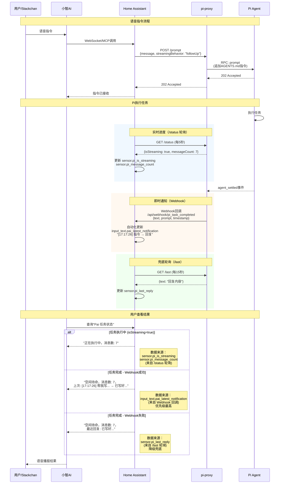

# pi-http-service

一个零依赖的 HTTP 服务，用来控制本机的 **pi**（coding agent）。它把 `pi --mode rpc` 子进程包成一组 REST + SSE 接口，让外部的 **Home Assistant**、脚本、看板等系统可以用普通的 HTTP 请求给 pi 下达指令、读取回复。

## 原理

```
Home Assistant ──HTTP──▶ pi-http-service ──JSONL/RPC──▶ pi --mode rpc ──▶ LLM
                     ◀──JSON / SSE──                    ◀──事件流/响应──
```

- `lib/rpc-client.mjs`：封装 `pi --mode rpc` 子进程（JSONL 分帧、请求/响应按 `id` 关联、事件流、自动应答扩展 UI 弹窗、崩溃自动重启）。
- `server.mjs`：HTTP 层，提供 REST 接口 + SSE 事件流 + 一个简易浏览器控制台 `/ui`。

## 快速开始

```bash
cd /Users/dajun/Opt/pi_workspace

# 1. （可选）复制一份配置
cp config.example.json config.json   # 按需修改 host/token/model

# 2. 启动
node server.mjs

# 或者用 npm
npm start
```

默认监听 `127.0.0.1:8787`。冒烟测试：

```bash
curl http://127.0.0.1:8787/healthz
curl http://127.0.0.1:8787/status

# 下达指令并等待回复（最长 60s）
curl -X POST http://127.0.0.1:8787/prompt \
  -H 'Content-Type: application/json' \
  -d '{"message":"只回复两个字：收到","wait":true}'
```

浏览器打开 `http://127.0.0.1:8787/ui` 可以看到控制台：支持实时事件流，顶部的令牌输入框在本机（loopback）访问时会自动预填；页面分「对话」「日志」两个页签——「对话」显示你或 HA 下发的指令与 pi 的回复，「日志」显示服务/pi 的运行日志。

## Home Assistant 集成

这是 pi-proxy 的核心使用场景：把 Pi 变成一个可以通过语音助手（小智AI）调度的智能家居"大脑"。

### 架构总览



### 数据流

**指令发送：**

```
用户语音 → 小智AI → Home Assistant → pi-proxy → Pi Agent
```

- 小智AI 通过 WebSocket MCP 协议与 HA 通信
- HA 通过 `rest_command.pi_prompt` 调用 pi-proxy，参数 `streamingBehavior: "followUp"` 让指令排队等待
- Pi 自动读取 workspace 的 `AGENTS.md` 作为系统指令（控制回复长度、语言等）

**结果获取（双通道）：**

| 通道 | 方式 | 延迟 | 数据内容 | HA 存储位置 |
|------|------|------|---------|------------|
| Webhook 回调 | 推送 | 即时 | 时间戳 + 原始指令 + 回复 | `input_text.pai_latest_notification` |
| REST 轮询 `/last` | 拉取 | ≤15秒 | 仅回复文本 | `sensor.pi_last_reply` |

- **Webhook（主通道）**：Pi 完成任务后 pi-proxy 立即回调 HA，格式化为 `[HH:MM:SS] 指令 → 回复`
- **REST 轮询（兜底）**：webhook 失败或 HA 重启后，通过轮询恢复状态

**状态监控：**

HA 每 5 秒轮询 `/status`，获取 `pi_is_streaming`、`pi_message_count`、`pi_running`，用于实时展示"正在执行中"。

### 用户看到的结果

模板传感器 **"Pai 任务状态"** 按优先级展示：

| 状态 | 显示内容 | 数据来源 |
|------|---------|---------|
| 执行中 | "正在执行中，消息数: X" | `/status` 轮询 |
| 完成（正常） | "[时间] 指令 → 回复" | Webhook 回调 |
| 完成（兜底） | "最近回复: 内容" | `/last` 轮询 |

优先级逻辑：

```
if isStreaming == true:
    → "正在执行中" (来自 /status)
elif webhook 通知有效:
    → webhook 通知 (优先级最高，即时推送)
elif /last 轮询有效:
    → 轮询回复 (降级兜底)
else:
    → "空闲待命"
```

### HA 配置

完整的 HA 配置片段（可直接使用）放在 [`pi-ha/`](pi-ha/) 目录下，附带 [SETUP_GUIDE.md](pi-ha/SETUP_GUIDE.md) 供 AI 自动配置。包含：

| 文件 | 作用 |
|------|------|
| `rest_commands.yaml` | REST 命令：`pi_prompt` / `pi_abort` / `pi_status` |
| `rest_sensors.yaml` | REST 传感器：轮询 `/last`（15s）和 `/status`（5s） |
| `template_sensors.yaml` | 模板传感器：合并数据源，统一展示"Pai 任务状态" |
| `input_helpers.yaml` | 输入辅助：用户指令 + webhook 通知缓存 |
| `automations.yaml` | Webhook 自动化：接收 pi-proxy 的任务完成回调 |

pi-proxy 侧需要配置 `webhookUrl`，指向 HA 的 webhook 地址：

```json
{
  "webhookUrl": "http://<HA_HOST>:8123/api/webhook/pi_task_completed"
}
```

### Workspace 指令（AGENTS.md）

Pi 会自动读取 workspace 目录下的 `AGENTS.md` 作为系统指令，控制回复行为：

```markdown
# Pai 工作指令

## 回复格式要求
- 所有回复必须控制在 **255 个字符以内**
- 简洁明了，避免冗长解释
- 如果是执行任务，直接报告结果

## 工作风格
- 优先执行，少问多做
- 回复使用中文
- 错误信息也要简短
```

这比在代码或客户端配置里加限制更干净——所有客户端（HA、UI、脚本）都受益，修改只需编辑文件，不需要重启服务。

### 关键设计决策

1. **`streamingBehavior: "followUp"`**：Pi 的 `steeringMode` 是 `one-at-a-time`，`followUp` 让新指令排队而不是被拒绝返回 500。
2. **Webhook + 轮询双通道**：Webhook 即时推送体验好，轮询兜底确保不丢结果。
3. **AGENTS.md 控制系统行为**：集中管理，所有客户端共享，不需要改代码。
4. **本地时间戳**：Webhook 回调使用本地时间（Asia/Shanghai），用户看到的是熟悉的格式。

## 配置

优先级：**环境变量 > config.json > 默认值**。

| 配置 | 环境变量 | 默认值 | 说明 |
|------|----------|--------|------|
| 监听地址 | `PI_HTTP_HOST` | `127.0.0.1` | 给 HA 用请设 `0.0.0.0` |
| 端口 | `PI_HTTP_PORT` | `8787` | |
| 访问令牌 | `PI_HTTP_TOKEN` | 空 | 设置后所有接口（除 `/healthz`）需鉴权 |
| 等待超时 | `PI_HTTP_WAIT_MS` | `60000` | `/prompt` 里 `wait:true` 的最长等待 |
| pi 可执行文件 | `PI_BIN` | `pi` | |
| pi 工作目录 | `PI_CWD` | 本目录 | pi 的 cwd，决定工具在哪执行 |
| pi 额外参数 | `PI_ARGS` | 空 | shell 风格，如 `--model anthropic/claude-sonnet-4-5 --no-session` |
| Webhook 回调 | `PI_HTTP_WEBHOOK_URL` | 空 | HA webhook 地址，任务完成后自动回调 |
| 日志目录 | `PI_HTTP_LOG_DIR` | `./logs` | 文件日志目录 |
| 日志滚动大小 | `PI_HTTP_LOG_MAX_SIZE` | `10485760`（10MB） | 超过后自动滚动 |
| 日志保留份数 | `PI_HTTP_LOG_MAX_FILES` | `5` | 滚动文件保留数量 |
| UI 令牌预填 | `PI_HTTP_UI_PREFILL_TOKEN` | `auto` | `auto`/`always`/`never` |

`config.json` 示例见 [`config.example.json`](config.example.json)。

### 鉴权

设置 `PI_HTTP_TOKEN`（或 config.json 的 `token`）后，请求需要带以下任一种凭据：

```
Authorization: Bearer <token>
X-Auth-Token: <token>
?token=<token>
```

`/healthz` 永远不需要令牌，方便做存活探测。

## 日志

服务会把运行日志写入文件（默认 `logs/pi-http.log`），同时保留在内存里供 UI/接口读取。

- **日志文件**：`logs/pi-http.log`，超过 `PI_HTTP_LOG_MAX_SIZE`（默认 10MB）自动滚动为 `pi-http.log.1`、`.2`…，最多保留 `PI_HTTP_LOG_MAX_FILES`（默认 5）份。
- **日志内容**：服务启动/pi 子进程生命周期、pi 的 stderr、HTTP 请求（prompt/bash/command）、以及「对话记录」（你或 HA 下发的指令 + pi 的回复）。
- **实时查看文件**：`tail -f logs/pi-http.log`。

日志也可通过接口读取，详见下面的 `GET /logs` 与 `GET /logs/stream`。

## API

所有响应均为 JSON。`/healthz` 之外，其余接口在开启令牌时都需要鉴权。

### `GET /healthz`

存活探测（无鉴权）。

```json
{ "ok": true, "running": true, "uptimeSec": 123 }
```

### `GET /status`

当前状态 + 最近一次回复。

```json
{
  "ok": true,
  "running": true,
  "pid": 12345,
  "uptimeSec": 60,
  "lastSeq": 42,
  "lastAssistantText": "收到",
  "state": {
    "model": { "id": "deepseek-v4-pro", "provider": "deepseek" },
    "thinkingLevel": "high",
    "isStreaming": false,
    "isCompacting": false,
    "sessionId": "...",
    "messageCount": 3,
    "pendingMessageCount": 0
  }
}
```

### `GET /messages`

返回完整会话消息（`get_messages` 的透传）。

```json
{ "ok": true, "messages": [ ... ] }
```

### `GET /last`

返回最近一次助手回复文本。

```json
{ "ok": true, "text": "收到" }
```

### `POST /prompt`

下达指令。

请求体：

```json
{
  "message": "帮我看看这个目录里有什么",
  "wait": true,
  "streamingBehavior": "followUp",
  "images": []
}
```

| 字段 | 说明 |
|------|------|
| `message` | 必填。指令文本 |
| `wait` | `true` 或毫秒数：等待本轮结束并返回回复；`false`/省略：立即返回 `202` |
| `streamingBehavior` | 可选。pi 正在输出时如何排队：`"steer"` / `"followUp"` |
| `images` | 可选。图片内容数组（base64） |

`wait:false`（默认）响应（立即）：

```json
{ "ok": true, "accepted": true, "queued": false }
```

`wait:true` 响应（等待 `agent_settled` 后）：

```json
{
  "ok": true,
  "accepted": true,
  "settled": true,
  "timedOut": false,
  "answer": "收到",
  "status": { "...": "..." }
}
```

> 注意：`wait:true` 最长等 `PI_HTTP_WAIT_MS`（默认 60s）。超时后 `settled:false`、`timedOut:true`，此时指令仍在后台执行，可稍后用 `/status` 或 `/last` 轮询结果。对于耗时较长的编码任务，建议用 `wait:false` + 轮询 `/last`。

### `POST /command`

任意 RPC 命令透传。请求体就是一条 RPC 命令，例如切换模型、压缩上下文、新建会话等：

```bash
# 新建会话
curl -X POST http://127.0.0.1:8787/command \
  -H 'Content-Type: application/json' -d '{"type":"new_session"}'

# 设置思考等级
curl -X POST http://127.0.0.1:8787/command \
  -H 'Content-Type: application/json' -d '{"type":"set_thinking_level","level":"low"}'
```

若命令是 `prompt` 且带 `wait` 字段，行为同 `/prompt`。完整命令清单见 pi 文档 `docs/rpc.md`。

### `POST /bash`

执行 shell 命令（不经过 LLM，直接由 pi 执行并把结果计入上下文）。

```bash
curl -X POST http://127.0.0.1:8787/bash \
  -H 'Content-Type: application/json' -d '{"command":"ls -la"}'
```

### `POST /abort`

中止当前正在进行的操作。

### `GET /events`

Server-Sent Events 事件流（供网页/外部程序实时订阅）。

```bash
curl -N 'http://127.0.0.1:8787/events?since=0&only=message_update,agent_settled'
```

| 参数 | 说明 |
|------|------|
| `since` | 从某个事件序号开始（含之后），用于断线重连补发 |
| `only` | 逗号分隔的事件类型白名单 |
| `responses` | `1` 时额外推送命令响应 |

事件类型：`agent_start` / `agent_end` / `agent_settled` / `turn_start` / `turn_end` / `message_start` / `message_update`（含 `text_delta` 增量）/ `tool_execution_start` / `tool_execution_end` / `queue_update` / `compaction_start` / `compaction_end` 等。

### `GET /logs`

返回最近的活动记录（服务日志、pi stderr、对话记录），支持 `?since=<seq>` 增量拉取。

```json
{
  "ok": true,
  "lastSeq": 42,
  "entries": [
    { "seq": 1, "ts": 1733234567890, "source": "service", "level": "info", "text": "pi started" },
    { "seq": 2, "ts": 1733234567890, "source": "chat", "kind": "user", "text": "帮我看看目录" },
    { "seq": 3, "ts": 1733234567890, "source": "chat", "kind": "assistant", "text": "目录里有…" }
  ]
}
```

### `GET /logs/stream`

活动记录的 Server-Sent Events 流，用于 UI 实时显示日志与对话。参数同 `/events` 的 `since`。

```bash
curl -N 'http://127.0.0.1:8787/logs/stream?since=0'
```

## 作为常驻服务运行

### macOS（launchd）

把 `pi-http-service.plist` 里的路径改成实际路径后：

```bash
cp pi-http-service.plist ~/Library/LaunchAgents/com.pi.http-service.plist
# 编辑其中的路径与 token
launchctl load ~/Library/LaunchAgents/com.pi.http-service.plist
launchctl start com.pi.http-service
```

### Linux（systemd）

```ini
[Unit]
Description=pi HTTP service
After=network.target

[Service]
WorkingDirectory=/home/you/pi_workspace
ExecStart=/usr/bin/node server.mjs
Environment=PI_HTTP_HOST=0.0.0.0
Environment=PI_HTTP_PORT=8787
Environment=PI_HTTP_TOKEN=your-strong-token
Restart=always
RestartSec=3

[Install]
WantedBy=multi-user.target
```

## 安全提醒

- 默认只监听 `127.0.0.1`；暴露到局域网时务必设置 `PI_HTTP_TOKEN`。
- 该服务等于给调用方提供了本机 shell（`/bash`、以及 pi 自带的 `bash` 工具）。**不要直接暴露到公网**，建议只在内网使用，必要时前面套一层反代 + TLS。
- 若只想让 pi 只读、不执行命令，可在 `PI_ARGS` 里加 `--no-tools`，或通过 `-e` 挂载自定义扩展做权限控制。

## 故障排查

### Webhook 不工作？
- 检查 pi-proxy 的 `config.json` 中 `webhookUrl` 是否正确
- 检查 HA 的 webhook ID 是否匹配
- 查看 pi-proxy 日志：`tail -f logs/pi-http.log`

### 状态不更新？
- 检查 HA 能否访问 pi-proxy：`curl http://<PI_HOST>:8787/healthz`
- 检查 REST sensor 的 `scan_interval` 配置
- 查看 HA 日志中的 REST 传感器错误

### 回复被截断？
- HA 的 state 限制 255 字符，`value_template` 会自动截断
- 检查 workspace `AGENTS.md` 中的字符限制指令是否生效
- 查看 `sensor.pi_last_reply` 的原始值

## 目录结构

```
pi_proxy/
├── server.mjs                        # HTTP 服务入口
├── lib/rpc-client.mjs                # pi RPC 子进程封装
├── config.example.json               # 配置样例（复制为 config.json 生效）
├── pi-ha/                            # Home Assistant 集成配置
│   ├── SETUP_GUIDE.md                # HA 配置指南（AI 可读）
│   ├── rest_commands.yaml            # REST 命令片段
│   ├── rest_sensors.yaml             # REST 传感器片段
│   ├── template_sensors.yaml         # 模板传感器片段
│   ├── input_helpers.yaml            # 输入辅助片段
│   └── automations.yaml              # Webhook 自动化
├── HOME_ASSISTANT_INTEGRATION.md     # HA 集成架构详细文档
├── pi-http-service.plist             # macOS launchd 服务样例
├── logs/                             # 运行日志（自动生成）
└── package.json
```
